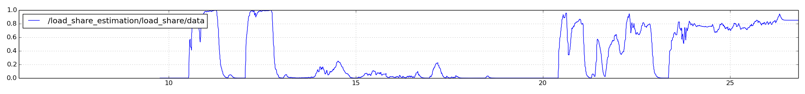

# Load Share Estimation
[](https://travis-ci.com/epfl-lasa/load-share-estimation)

This ROS package is used to compute the load share of an object being supported by a robot and a third party (such as a person).
The **load share** is the proportion of the object's weight supported by the robot, and varies during cooperative tasks such as manipulation or handovers.
For example during a handover, the load share smoothly goes from 1.0 (the robot is supporting the object) to 0.0 (the human is supporting the object).
Properly estimating this load share is key to enabling smooth human-robot handovers.

Some features of this package are:

 - Works in any end-effector configuration: up, down, sideways, etc...
 - Accounts for object dynamics (i.e. forces due to acceleration).
 - Input-light: requires only force/torque sensor readings and end-effector acceleration.
 - The only information necessary about the object is its *mass*.
 - Only requires knowing a few masses in the system: the object, the tool (hand/gripper/etc..), and the force/torque sensor plate.
 - Highly configurable: change topics, filtering parameters, masses, etc... through a simple yaml configuration file.

The rest of this README explains in detail the necessary inputs and how to configure the package.
We also provide a complete example using recorded data.

This package is an open-source implementation of the load share estimation module in the following paper:

> A Human-Inspired Controller for Fluid Human-Robot Handovers. International Conference on Humanoid Robots, 2016. Jose Medina, Felix Duvallet, Murali Karnam, and Aude Billard.

If you use this package in your research, please cite the above paper.

## Running a simple example.

NOTE: Everything here is run from the root of the repository.

1. Start roscore & load the parameters
```
$ roscore
```
```
$ rosparam load load_share_demo/params.yaml
```

1. Start the load share estimation node
```
$ roslaunch load_share_estimation load_share_estimation.launch config:=load_share_estimation/config/load_share_estimation_config.yaml
```
1. Play the bag file
```
$ rosbag play load_share_demo/load_share_demo.bag
```
1. Plot the load share
```
$ rqt_plot /load_share_estimation/load_share
```

You should see the load share evolve over time, always between zero and one:



## Inputs and required components

The components we reason about are:
 - The robot end-effector
 - The force/torque sensor (mounted on the end-effector)
 - The tool: what is holding the object (mounted on the other side of the force/torque sensor), it could be a hand, a gripper, tray, etc...
 - The object: what we are transferring.

We must know the following component masses:

 - The mass of the object (in kg)
 - The mass of the tool (in kg)
 - The mass of the force/torque sensor plate (in kg), which is the part that's not bolted on the arm.

Note: the f/t sensor *plate* mass is a little tricky to estimate.
We determined it experimentally by zero-ing the sensor with the plate hanging
freely down, then flipping the sensor so the plate is up (all forces should be
along the z-axis).
Then, the mass of the plate (m_plate) will be given by the force in the z-axis (F_z):

> -2 * m_plate * g = F_z

The node computes the **wrenches expressed in the world frame**.
For this, we need access to the following pieces of information:

  - The force/torque sensor data.
  - The sensor's pose (as a `tf`).
  - The robot root's pose (as a `tf) in the world frame.
  - The end-effector acceleration (see note below).

Internally, we express all forces in the world frame.
The acceleration (along with information about the hand/object mass) enables us to compute the effect of the robot dynamic on the sensed forces.
This in turn can be used to remove the forces due to dynamics (i.e. acceleration of the object).

If you do not have access to the acceleration, we can suggest two solutions:
  - Use a [Savitzky-Golay filter](https://github.com/epfl-lasa/sg_differentiation)
    to compute the acceleration given the end-effector position or velocity.
    In practice, the Savitzky-Golay filter provides a much smoother acceleration
    estimate than simply doing numerical differentiation across samples.
  - Just ignore dynamics, and do without acceleration information. Note this
    means your load-share estimate will be wrong anytime the end-effector is
    moving.

## Configuration

This node is configured using a yaml file that lists the topic names for the
f/t sensor and robot acceleration, the name of the TF frames, the mass of
each component, and various filtering parameters:

```
# Topics to subscribe to.
topics:
  ft_sensor: '/ft_sensor/netft_data'
  robot_ee_accel: '/lwr/ee_accel'

# Name of the ROS parameter where the robot orientation *at calibration time*
# was stored.
calibration_orientation_param_name: '/lwr_orientation_at_calibration'

# These are the TF frame names for the f/t sensor and robot root.
frame_names:
  ft_sensor: /ft_sensor
  robot_root: /robot_root

# These are the masses of the various object parts.
masses:
  object: 0.514
  tool: 1.453
  ft_plate: 0.112

# Incoming time delay to add to force/torque sensor data (so that it matches
# with the filtered acceleration signal).
ft_sensor_delay: 0.1

# Parameters (alpha) for exponential smoothing
#   x = alpha * cur_raw + (1 - alpha) * x_last
filtering_params:
  smoothing_load_share: 0.1
  smoothing_force: 0.25
  smoothing_torque: 0.25
```

A configuration file must be passed to the node at startup.
It should enable you to change all the configurable run-time parameters without
having to dig into the code.

## Outputs

The node outputs information on several topic:

 * /load_share_estimation/load_share [std_msgs/Float64]:
   The proportion of the object's mass supported by the
   robot, in the range between 0 (no support) and 1.0 (full support).
 * /load_share_estimation/internal_wrench [geometry_msgs/WrenchStamped]:
   Internal forces on the object that are
   counteracting forces between the robot and the other party (these are
   unecessary to accomplish a transfer).
 * /load_share_estimation/dynamic_load_share [std_msgs/Float64]:
   The proportion of the dynamics forces which induce motion that the robot
   is accounting for.

In addition, we publish some debugging information on sub-topics:

 * /load_share_estimation/debug/measured_force_world [geometry_msgs/WrenchStamped]:
   The current measured force, expressed in the world frame. This is simply the
   f/t measurement with a frame transformation applied to it.
 * /load_share_estimation/debug/dynamics_from_object_observed [geometry_msgs/WrenchStamped]:
   The observed force due to the object's dynamics, i.e.
   `F_current_dynamics = mass * acceleration`.
 * /load_share_estimation/debug/dynamics_from_object_expected [geometry_msgs/WrenchStamped]:
   The *expected* part of measured forces due to the object's dynamics, i.e.
   `F_expected_dynamics = F_current - F_static_expected`.


## Calibration

It is very important to calibrate the f/t sensor before running the node.
This calibration should occur *without* the object in the hand.

At calibration time, we store the robot end-effector orientation as a ROS
parameter, so that we can recover the actual forces during operation.

The calibration procedure should 'zero out' the force/torque sensor. In other
words, after calibration the published force and torque measurements should be
approximately zero.
If your sensor calibration doesn't offset the readings to produce zero right
after calibration, you can easily add a 'remember this offset' step at
initialization in this code.


## Other parameters

 - force/torque delay: In some cases, a filter to compute the robot acceleration
   induces a delay in the acceleration measurement. We use a ROS
   `message_filters::TimeSequencer` to add a delay the incoming f/t messages
   by a constant time offset.

 - force/torque filtering: We filter the force and torque measurement using an
   exponential smoother, you can change the filtering parameter (for example,
   this might be important if you change the running frequency of the estimation
   loop).

 - load share filtering: We filter the computed load share in the exact same
   way, you can change the exponential smoother parameter.
